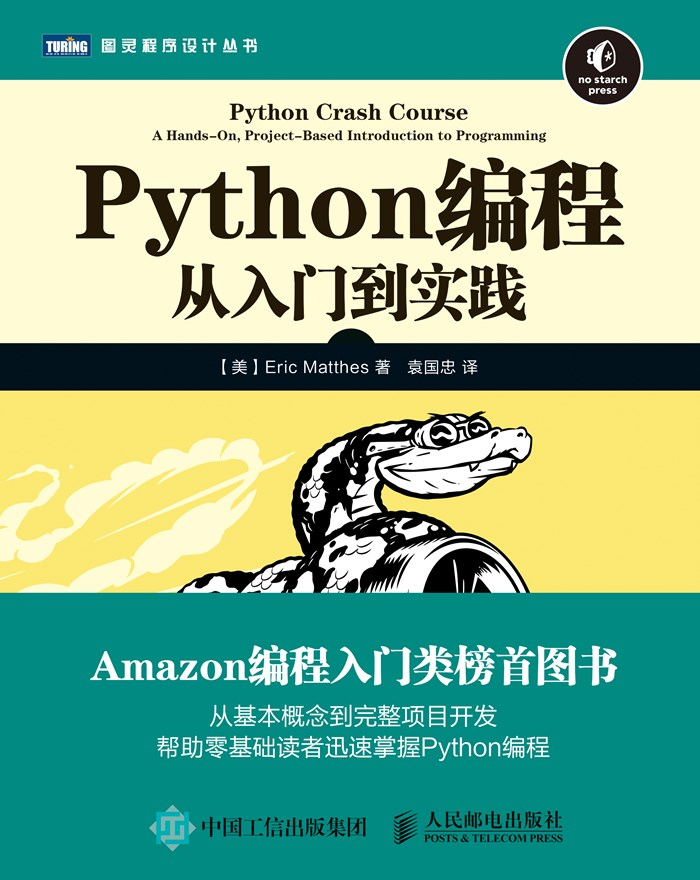
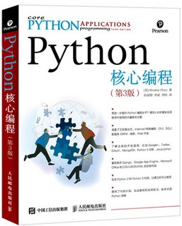
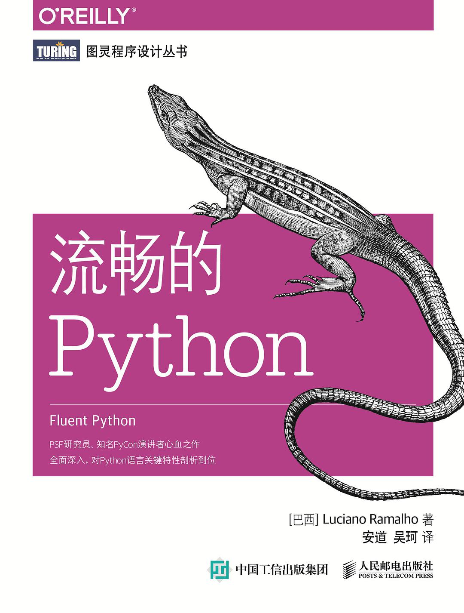
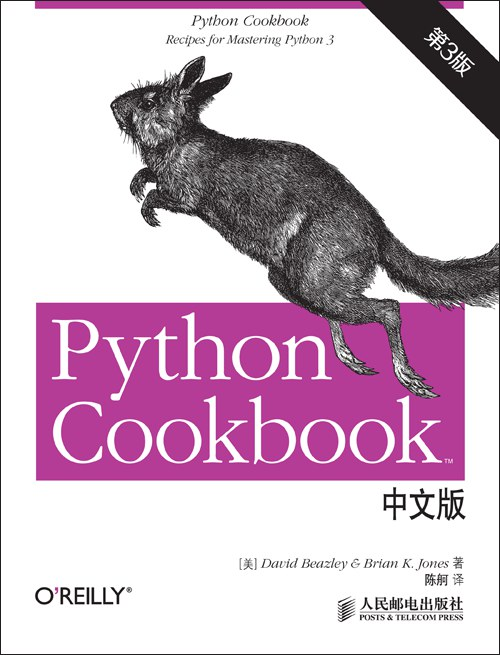
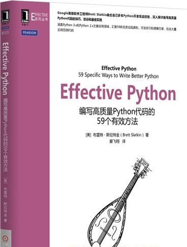
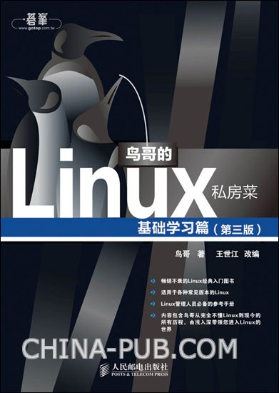
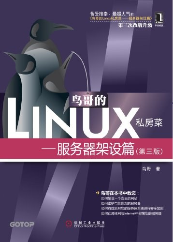
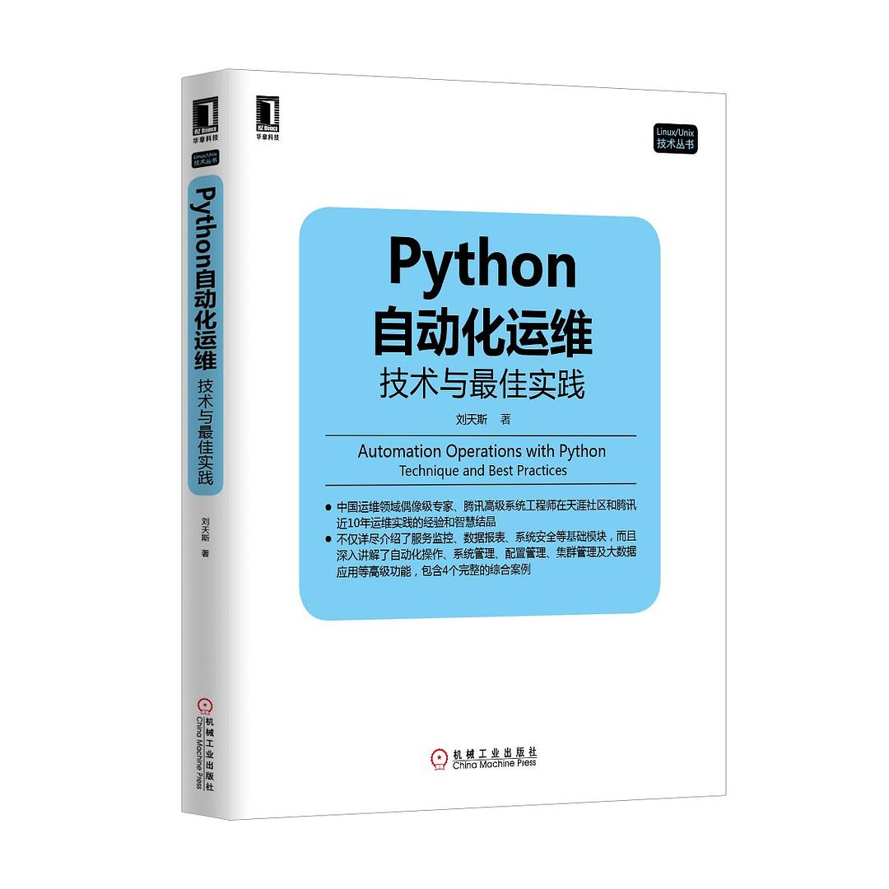

适合收藏在书架上的几本入门Python书籍。

## 前言

最近在慕课网上线了两门Python入门相关的课程：

[Python3 入门教程 2020全新版](https://www.imooc.com/learn/1261)

[Python3 进阶教程 2020全新版](https://www.imooc.com/learn/1264)

课程对于初学Python的同学，可以起到很好的入门的作用，但受限于课程的课时，依然还有很多Python的基础知识没有呈现，虽然说通过学习这两门课程，可以具备一定的自学能力，但对于大部分同学而言，学完以后，兴许依然会有些迷茫，以下推荐一些Python入门相关的书籍，希望可以帮助到大家。

## 书籍列表

### Python语言系列

#### 官方文档

其实Python官方文档就是最好的文本学习资料，现在Python官方文档大部分已支持中文。

[官方文档Python教程](https://docs.python.org/zh-cn/3/tutorial/index.html)

#### 《Python编程：从入门到实践》

非常基础的入门书籍，适合对Python感兴趣的任何层次的读者阅读，零基础入门。从基本概念到完整项目开发，帮助零基础读者迅速掌握Python编程上到有编程基础的程序员，下到10岁少年，想入门Python并达到可以开发实际项目的水平，本书都是非常推荐的！

#### 《Python核心编程（第3版）》

《Python核心编程》系列一直是畅销的Python书籍。相比《Python编程：从入门到实践》，这本书适合有一定Python基础的同学学习，对于前面刚好学习了前面慕课网两门课程的同学来说，是非常合适的。

书的内容分三部分：

第一部分为讲解了Python的一些通用应用，包括正则表达式、网络编程、Internet客户端编程、多线程编程、GUI编程、数据库编程、Microsoft Office编程、扩展Python等内容。

第二部分讲解了与Web开发相关的主题，包括Web客户端和服务器、CGI和WSGI相关的Web编程、Django Web框架、云计算、高级Web服务。

第三部分则为一个补充/实验章节，包括文本处理以及一些其他内容。 

#### 《流畅的Python》

同样作为Python语言进阶的书籍，这本书从很多新的角度介绍Python语言的特性。特别是关于上下文管理器、装饰器、协程和Future的部分，可以看到很多特别的技术，非常有意思，大开眼界。

#### 《Python Cookbook》

《Python Cookbook》是一本非常畅销的Python书籍，评分也很高，内容上比较模块化，其主题涵盖了数据结构和算法，字符串和文本，数字、日期和时间，迭代器和生成器，文件和I/O，数据编码与处理，函数，类与对象，元编程，模块和包，网络和Web编程，并发，实用脚本和系统管理，测试、调试以及异常，C语言扩展等。常见的Python问题都可以从中找到答案。

#### 《Effective Python》

和前面的不同，这本书专注于介绍使用更加Pythonic的方式编程，让Python在你的手上可以更好的发挥出Python语言本身的强大功能，写出耦合度低、更加健壮、更加高效的代码。

### Python Web框架系列

很多人最初接触Web框架，其实应该都不太了解**框架**这一词，也糊里糊涂的学习上了Django、Flask等的这些框架。其实总的来说，框架就是封装了通用的东西，让你在开发一个专用的项目的时候，不用在一些通用的逻辑上花费太多的时间。

就以做网站为例子，鉴权、路由、缓存等等这些都是通用的技术，那很多框架就都会封装起来形成工具使用，这样的话，不管开发者是开发购物网站、论坛网站还是别的，都可以用上这些工具。

#### Django

就学习Django本身，阅读Django官方文档是最好的学习途径，并且文档本身支持中文，阅读起来毫无障碍。对于结合案例的学习，可以了解一些慕课网的Django实战课程，而Django相关的书籍较少，内容也老旧，并且Django版本的迭代很快，看内容老旧的书籍容易陷入困惑。

[Django官方文档](https://docs.djangoproject.com/zh-hans/3.1/)

#### Flask

同样的，学习Flask建议从官方文档入手，并且Flask文档本身也是中文的，非常容易阅读。而对于案例的学习，则可以结合慕课网的实践课程。

[Flask官方文档](http://docs.jinkan.org/docs/flask/)

#### Tornado

Tornado作为比较难的Python Web框架，理解起来有一些晦涩，主要是对IOLoop、coroutine等概念比较陌生，官方文档只有英文的，不过国内有很多热心的开发者翻译了中文版本，可以结合着来看。同样推荐通过官方文档学习。

[Tornado官方文档](https://www.tornadoweb.org/en/stable/)

[Tornado中文文档](https://www.osgeo.cn/tornado/)

### Python 运维系列

对于运维而言，其实核心是Linux，其次才是Python工具，所以以下会推荐一些Linux相关的书籍。

首先是Linux入门相关的两本书籍，可以说是非常经典的两本书了，当年在大学计算机系以宿舍为单位，几乎每个宿舍都能找到完整一套，是了解和入门Linux必备的书籍。

#### 《鸟哥的Linux私房菜基础学习篇》

#### 《鸟哥的Linux私房菜服务器篇》

#### 《Python自动化运维》

挺全面的一本书，围绕自动化运维介绍了系统基础信息、服务监控、数据报表、系统安全等各个模块的运维技能，内容的广度满足大家对运维技术的了解，但深度仍需要自行钻研。

----

欢迎关注慕课网-咚咚呛。

- [慕课网主页](https://www.imooc.com/t/350968)
- 公众号：

    